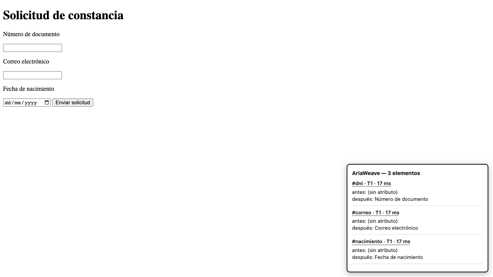

# AriaWeave

**Names the buttons and links nobody labelled — and describes the images, when
your machine can.**

A Chrome extension (MV3) that repairs accessibility naming on any page, live, in
the browser. It finds unlabelled controls and images, works out what they are,
and writes real `alt` and `aria-label` attributes into the DOM — so the reader's
own screen reader simply works better.

Not an SEO tool for site owners. Assistive infrastructure for the person
browsing, on sites they do not own and cannot file a ticket against.



## Why controls first

We counted. Across five gob.pe pages, elcomercio.pe, cnn.com and a technical
blog, **almost every image already had an `alt`** — CMSs require it and SEO
tooling nags about it. Every real gap we found in a week of live browsing was a
**control**: icon links, carousel buttons, unlabelled form fields.

Those are named by rules, with no model at all:

| Signal | Real example | Result |
|---|---|---|
| Text beside the field | gob.pe news filter | `Fecha de inicio` |
| The `href` itself | `/contacto` | `Contacto` |
| The hostname | a link to facebook.com | `Ir a Facebook` |
| The element's own class | `v-short__nav--left` | `Anterior` |
| A `<title>` inside the icon's SVG | a search button | `Buscar` |
| A filename that is really a caption | a CNN wire photo | the journalist's own sentence |

On elcomercio.pe that is **four controls named in seven milliseconds**, free and
offline. Images are the second act.

## Install

Not on the Web Store. Load it unpacked:

1. `chrome://extensions` → turn on **Developer mode**
2. **Load unpacked** → select this folder
3. Open any page and click the toolbar icon

Chrome 138+ on desktop. Nothing else to install, no account, no API key.

**Optional, for image descriptions:** the first time an image needs the
on-device model, Chrome asks to fetch it (~4 GB, once, shared by the whole
browser). Decline and everything above still works — you simply get honest
generic text for photographs instead of descriptions.

## How it decides

A deterministic router runs first and decides whether a model is needed at all:
already labelled → skip, decorative → `alt=""`, otherwise climb the ladder.
Every rung answers to a verifier; only a rejection escalates to a costlier one.

| Tier | What it is | Cost per element |
|---|---|---|
| **T1** rules | `href`, class, SVG `<title>`, nearby text, input type | **~2 ms**, nothing |
| **T3** Gemini Nano | vision, on-device | ~1.5 s, free after the one-time download |
| T4 cloud | vision, by API | ~3 s and about $0.003 — **specced, not wired** |

T4 stays unwired on purpose. At those prices someone browsing a hundred pages a
day would spend about $5 a day to label pictures; for a free accessibility tool
that is not expensive, it is impossible. T2 (OCR) was dropped after measuring
that T3 already reads text out of images — see [SPEC §7.1](docs/SPEC.md).

## What it does not do

- **Naming only.** Not focus order, not contrast, not keyboard traps.
- **Not everywhere.** No `chrome://` pages, no Web Store, no closed shadow DOM.
- **A photograph needs the model.** Without it, images get honest generic text
  rather than a guess — a wrong description is worse than none.
- **Per-session, per-user.** It fixes the page for this person, now. That is the
  positioning, not a shortfall.

## Running the harness

```
npm install
npm test                      # headless; does not steal focus
ARIAWEAVE_HEADED=1 npm test   # watch it happen
```

73 tests over 16 fixtures, including a live snapshot of a real gob.pe page. It
drives your installed Chrome rather than Playwright's Chromium, because Gemini
Nano is a Chrome browser component — so `npm install` pulls three packages and
no browser.

The suite's vision assertions are opt-in (`--project=needs-model`), because a
clean Chrome profile has no on-device model and pretending otherwise would make
the criterion untestable rather than tested.

## Documents

| File | What it is |
|---|---|
| [docs/SPEC.md](docs/SPEC.md) | What is built, the contracts, the definition of done, and every decision that was reversed |
| [docs/SYSTEM.md](docs/SYSTEM.md) | How it was built: isolated lanes, worktrees, the harness-first order |
| [AI-DEV-LOG.md](AI-DEV-LOG.md) | What actually happened, including the parts that went wrong |
| [docs/FINDINGS.md](docs/FINDINGS.md) | Open findings, with what was measured and what is still undecided |
| [CHANGELOG.md](CHANGELOG.md) | User-facing changes |

## Status

All five criteria in [SPEC §6](docs/SPEC.md) are met: accessibility violations
go to zero on the corpus, descriptions pass quality and similarity checks, the
autonomous verifier loop is recorded verbatim, the latency and idempotency
budgets are measured, and a real Peruvian government page is captured and
tested offline.

Built for Howdy Dev Day 2026.
